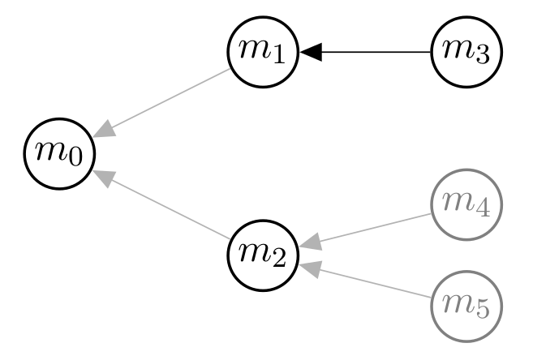

# Coreference Resolution with cort

The coreference resolution component of __cort__ casts coreference resolution
as a structured prediction task with latent variables. The core idea is that
approaches to coreference resolution usually do not predict the assignment of 
mentions to entities directly, but rather output an auxiliary intermediate 
structure, from which the assignment of mentions to entities is then 
inferred.

This point of view yields an *unified representation* of approaches to
coreference resolution. __cort__ provides an interface to define approaches
based on this representation.

To define an approach to coreference resolution, the user has to provide
* a definition of the auxiliary structure the approach relies on,
* a decoder, which computes the highest scoring auxiliary structure given 
  learned weights,
* a cost function that assigns costs to decisions when constructing the 
  latent structure, and
* an algorithm for extracting entity assignments from the auxiliary structure.

## Contents

* [Framework](#framework)
* [Case Study: the Mention Ranking Model](#ranking)
* [Running cort](#running)
* [Model Downloads and Results](#models)

## <a name="framework"></a> Framework

We first give an overview of the framework which we will use to represent the
model (taken form our 
[ACL'15 Demo paper](http://www.aclweb.org/anthology/P/P15/P15-4011.pdf)). The 
framework is described in more detail in our 
[TACL paper](http://www.aclweb.org/anthology/Q/Q15/Q15-1029.pdf). For the 
references, please consult these papers.

### Motivation

The popular mention pair approach (Soon et al. 2001; Ng and Cardie, 2002) 
operates on a *list* of mention pairs. Each mention pair is considered 
individually for learning and prediction. In contrast, antecedent tree models 
(Fernandes et al. 2014; Björkelund and Kuhn, 2014) operate on a *tree* 
which encodes all anaphor-antecedent decisions in a document.

Conceptually, both approaches have in common that the structures they employ 
are not annotated in the data (in coreference resolution, the annotation 
consists of a mapping of mentions to entity identifiers). Hence, we can view 
both approaches as instantiations of a generic structured prediction approach 
with latent variables.

### Setting

Our aim is to learn a prediction function **f** that, given an input document 
**x** predicts a pair **(h,z)**. **h** is the (unobserved) latent/auxiliary 
structure encoding the coreference relations between mentions in **x**. 
**z** is the mapping of mentions to entity identifiers (which is observed in 
the training data). **z** is obtained from **h** using some algorithm, such as
transitive closure or best-first clustering (depending on the approach in 
focus).

### Representation

For a document **x**, we write **M_x = {m_1, ..., m_n}** for the mentions in 
**x**. Following previous work (Chang et al., 2012; Fernandes et al., 2014), 
we make use of a *dummy mention* which we denote as **m_0**. If **m_0** is 
predicted as the antecedent of a mention **m**, we consider **m** 
non-anaphoric. We define **M_x^0** as the union of **{m_0}** and **M_x**.

Inspired by previous work (Bengtson and Roth, 2008; Fernandes et al. 2014;
Martschat and Strube, 2014), we adopt a graph-based representation of the 
latent structures. In particular, we express structures by 
*labeled directed graphs* with vertex set **M_x^0**. 



The figure above shows a structure underlying the mention ranking and 
the antecedent tree approach. An arc between two mentions signals 
coreference. For antecedent trees, the whole structure is 
considered, while for mention ranking only the 
antecedent decision for one anaphor is examined. This can be expressed via an 
appropriate segmentation into subgraphs which we refer to as *substructures*. 
One such substructure encoding the antecedent decision for **m_3** is colored 
black in the figure.

Via arc labels we can express additional information. For example, mention 
pair models distinguish between *positive* and *negative* instances. This can 
be modeled by labeling arcs with appropriate labels, such as **+** and **-**.

### Inference and Learning

As is common in natural language processing, we model the prediction of 
**(h,z)** via a linear model. To learn the parameter vector from training data, 
we employ a latent structured perceptron (Sun et al., 2009) with 
cost-augmented inference (Crammer et al., 2006) and averaging (Collins, 2002). 


## <a name="ranking"></a> Case Study: the Mention Ranking Model

When devising a model, we first need to define a graph-based representation of
the structures underlying the model. Here we consider the mention ranking 
model (Denis and Baldridge, 2008; Chang et al., 2012). It models coreference 
resolution as a *ranking problem*: for each anaphor we consider all candidate
antecedents. Among these antecedents, the best-scoring antecedent according to 
the model is selected.

We will now define the graph-based structures underlying the model, devise 
decoders to extract highest-scoring structures, define a suitable cost function,
and also give the algorithm for extracting coreference sets from the decisions
by the mention pair model.

### Defining the Graphs

We first need to define which graphs the decoder will consider. For the 
mention ranking model, the latent structure models the different antecedent
decisions for one anaphor. Hence, each substructure contains only one edge,
which is the antecedent decision for the anaphor. Candidate edges for the
substructure for an anaphor **m_j** are all edges **(m_j,m_i)** for 
**i > j**. 

The following function extracts these candidate edges.

```python
def extract_substructures(doc):
    """ Extract the search space for the mention ranking model,

    The mention ranking model consists in computing the optimal antecedent
    for an anaphor, which corresponds to predicting an edge in graph. This
    functions extracts the search space for each such substructure (one
    substructure corresponds to one antecedent decision for an anaphor).

    The search space is represented as a nested list of mention pairs. The
    mention pairs are candidate arcs in the graph. The ith list contains all
    potential (mention, antecedent) pairs for the ith mention in the
    document. The antecedents are ordered by distance. For example,
    the third list contains the pairs (m_3, m_2), (m_3, m_1), (m_3, m_0),
    where m_j is the jth mention in the document.

    Args:
        doc (CoNLLDocument): The document to extract substructures from.

    Returns:
        (list(list((Mention, Mention)))): The nested list of mention pairs
        describing the search space for the substructures.
    """
    substructures = []

    # iterate over mentions
    for i, ana in enumerate(doc.system_mentions):
        for_anaphor_arcs = []

        # iterate in reversed order over candidate antecedents
        for ante in sorted(doc.system_mentions[:i], reverse=True):
            for_anaphor_arcs.append((ana, ante))

        substructures.append(for_anaphor_arcs)

    return substructures
```

### Devising the Decoder

In the next step, we define *decoders*. These are functions that extract the
highest-scoring substructure **h'** (according to the model) from the set of
candidate edges. Besides the highest-scoring substructure, it also extracts 

* the highest-scoring substructure *consistent with the gold annotation* **h***, 
  and
* whether the **h'** is consistent with the gold annotation.
  
This additional information is important for the weight update during learning:
if **h'** is not consistent with the gold annotation, all weights for features of
**h'** are decreased by 1, while all weights for features of **h*** are increased by
1.

The decoder for the mention ranking model just goes through all candidate arcs for a 
substructure and selects the highest-scoring arc. To do so, it makes use of the 
utility functioon ``find_best_arcs``.

```python
class RankingPerceptron(perceptrons.Perceptron):
    """ A perceptron for mention ranking with latent antecedents. """
    def argmax(self, substructure, arc_information):
        """ Decoder for mention ranking with latent antecedents.

        Compute highest-scoring antecedent and highest-scoring antecedent
        consistent with gold coreference information for one anaphor.

        Args:
            substructure (list((Mention, Mention))): The list of mention pairs
                which define the search space for one substructure. For mention
                ranking, this list consists of all potential anaphor-antecedent
                pairs for one fixed anaphor in descending order, such as
                    (m_3, m_2), (m_2, m_1), (m_2, m_0)
            arc_information (dict((Mention, Mention), (array, array, bool)): A
                mapping of arcs (= mention pairs) to information about these
                arcs. The information consists of the features (represented as
                an int array via feature hashing), the costs for the arc (for
                each label, order as in self.get_labels()), and whether
                predicting the arc to be coreferent is consistent with the gold
                annotation).

        Returns:
            A 6-tuple describing the highest-scoring anaphor-antecedent
            decision, and the highest-scoring anaphor-antecedent decision
            consistent with the gold annotation. The tuple consists of:

                - **best_arcs** (*list((Mention, Mention))*): the
                  highest-scoring antecedent decision (the list contains only
                  one arc),
                - **best_labels** (*list(str)*): empty, the ranking approach
                  does not employ any labels,
                - **best_scores** (*list(float)*): the score of the
                  highest-scoring antecedent decision,
                - **best_cons_arcs** (*list((Mention, Mention))*): the
                  highest-scoring antecedent decision consistent with the gold
                  annotation (the list contains only one arc),
                - **best_cons_labels** (*list(str)*): empty, the ranking
                  approach does not employ any labels
                - **best_cons_scores** (*list(float)*): the score of the
                  highest-scoring antecedent decision consistent with the
                  gold information
                - **is_consistent** (*bool*): whether the highest-scoring
                  antecedent decision is consistent with the gold information.
        """
        best, max_val, best_cons, max_cons, best_is_consistent = \
            self.find_best_arcs(substructure, arc_information)

        return (
            [best],
            [],
            [max_val],
            [best_cons],
            [],
            [max_cons],
            best_is_consistent
        )
```        
        
We also give an alternative decoder, which differs from the decoder above during 
*learning*. The decoder above considers the highest-scoring substructure 
consistent with the gold annotation during learning:

The alternative decoder, however, makes updates with respect to the substructure 
obtained by always taking the closest correct antecedent for an anaphor as an
arc. 

```python
class RankingPerceptronClosest(perceptrons.Perceptron):
    """ A perceptron for mention ranking with closest antecedents for training.
    """
    def argmax(self, substructure, arc_information):
        """ Decoder for mention ranking with closest antecedents for training.

        Compute highest-scoring antecedent and closest gold antecedent for one
        anaphor.

        Args:
            substructure (list((Mention, Mention))): The list of mention pairs
                which define the search space for one substructure. For mention
                ranking, this list consists of all potential anaphor-antecedent
                pairs for one fixed anaphor in descending order, such as
                    (m_3, m_2), (m_3, m_1), (m_3, m_0)
            arc_information (dict((Mention, Mention), (array, array, bool)): A
                mapping of arcs (= mention pairs) to information about these
                arcs. The information consists of the features (represented as
                an int array via feature hashing), the costs for the arc (for
                each label, order as in self.get_labels()), and whether
                predicting the arc to be coreferent is consistent with the gold
                annotation).

        Returns:
            A 6-tuple describing the highest-scoring anaphor-antecedent
            decision, and the anaphor-antecedent pair with the closest gold
            antecedent. The tuple consists of:

                - **best_arcs** (*list((Mention, Mention))*): the
                  highest-scoring antecedent decision (the list contains only
                  one arc),
                - **best_labels** (*list(str)*): empty, the ranking approach
                  does not employ any labels,
                - **best_scores** (*list(float)*): the score of the
                  highest-scoring antecedent decision,
                - **best_cons_arcs** (*list((Mention, Mention))*): the
                  anaphor-antecedent pair with the closest gold antecedent (the
                  list contains only one arc),
                - **best_cons_labels** (*list(str)*): empty, the ranking
                  approach does not employ any labels
                - **best_cons_scores** (*list(float)*): the score of the
                  anaphor-antecedent pair with the closest gold antecedent
                - **is_consistent** (*bool*): whether the highest-scoring
                  antecedent decision is consistent with the gold information.
        """
        max_val = float("-inf")
        best = None

        max_cons = float("-inf")
        best_cons = None

        best_is_consistent = False

        for arc in substructure:
            consistent = arc_information[arc][2]
            score = self.score_arc(arc, arc_information)

            if score > max_val:
                best = arc
                max_val = score
                best_is_consistent = consistent

            # take closest
            if not best_cons and consistent:
                best_cons = arc
                max_cons = score

        return (
            [best],
            [],
            [max_val],
            [best_cons],
            [],
            [max_cons],
            best_is_consistent
        )
```

### Cost Functions

Both decoders we presented above make use of *cost functions* during learning.
These functions assign integer costs to specific arcs when adding them to
the graph. This leads to a large margin approach.

For the mention ranking model, we make use of a variant of a cost function
employed in Fernandes et al. (2014), shown below.

```python
def cost_based_on_consistency(arc, label="+"):
    """ Assign cost to arcs based on consistency of decision and anaphoricity.

    An anaphor-antecedent decision is consistent if either
        (a) the mentions are coreferent, or
        (b) the antecedent is the dummy mention, and the anaphor does not have
            any preceding coreferent mention among all extracted mentions.

    Note that (b) also contains cases where the mention has an antecedent in the
    gold data, but we were unable to extract this antecedent due to errors in
    mention detection.

    If the anaphor-antecedent decision represented by ``arc``is consistent, it
    gets cost 0. If the the decision is not consistent, and the antecedent is
    the dummy mention, it gets cost 2. Otherwise, it gets cost 1.

    Args:
        arc ((Mention, Mention)): A pair of mentions.
        label (str): The label to predict for the arc. Defaults to '+'.

    Return:
        (int): The cost of predicting the arc.
    """
    ana, ante = arc

    consistent = ana.decision_is_consistent(ante)

    # false new
    if not consistent and ante.is_dummy():
        return 2
    # wrong link
    elif not consistent:
        return 1
    else:
        return 0
```

### Extracting Coreference Sets

The output of the decodeder is a nested list of mention pairs: all pairs in one list
constitute one predicted substructure.
 
For the mention ranking model it is simple to obtain coreference chains from this output:
we just need to take the transitive closure over the anaphor-antecedent decisions 
represented by the pairs. However, other models may require more complex algorithms
to obtain coreference sets. We therefore need to explicitly provide the toolkit with a 
method to extract coreference chains from the output. 
 
The function below implements the transitive closure. 

```python
def all_ante(substructures, labels, scores, coref_labels):
    """ Extract coreference clusters from coreference predictions via transitive
    closure.

    In particular, go through all (anaphor, antecedent) pairs contained in
    ``substructures``, and obtain coreference clusters by transitive closure.

    Args:
        substructures (list(list((Mention, Mention)))): A list of substructures.
        labels (list(list(str))): Not used by this function.
        labels (list(list(str))): Not used by this function.
        coref_labels (set(str)): Not used by this function.

    Returns
        A tuple containing two dicts. The components are

            - **mention_entity_mapping** (*dict(Mention, int)*): A mapping of
              mentions to entity identifiers.
            - **antecedent_mapping** (*dict(Mention, Mention)*): A mapping of
              mentions to their antecedent.
    """
    mention_entity_mapping = {}
    antecedent_mapping = {}

    for substructure in substructures:
        for pair in substructure:
            anaphor, antecedent = pair

            # skip dummy antecedents
            if antecedent.is_dummy():
                continue

            antecedent_mapping[anaphor] = antecedent

            # antecedent is not in the mapping: we initialize a new coreference
            # chain
            if antecedent not in mention_entity_mapping:
                # chain id: index of antecedent in system mentions
                mention_entity_mapping[antecedent] = \
                        antecedent.document.system_mentions.index(antecedent)

            # assign id based on antecedent
            mention_entity_mapping[anaphor] = \
                mention_entity_mapping[antecedent]

    return mention_entity_mapping, antecedent_mapping
```

### Features

By default, **cort** runs with a standard feature set. Each feature takes as input a 
mention or a pair of mention, and outputs a tuple: the name of the feature and the
value of the feature. The value can be a string, a boolean, or a numeric value.

You can define your own set of features and give it as a parameter to the toolkit. 
To do so, write the function names (using the full paths) of the features in a text 
file. As an example, here is the standard feature set:

```
cort.coreference.features.fine_type
cort.coreference.features.gender
cort.coreference.features.number
cort.coreference.features.sem_class
cort.coreference.features.deprel
cort.coreference.features.head_ner
cort.coreference.features.length
cort.coreference.features.head
cort.coreference.features.first
cort.coreference.features.last
cort.coreference.features.preceding_token
cort.coreference.features.next_token
cort.coreference.features.governor
cort.coreference.features.ancestry
cort.coreference.features.exact_match
cort.coreference.features.head_match
cort.coreference.features.same_speaker
cort.coreference.features.alias
cort.coreference.features.sentence_distance
cort.coreference.features.embedding
cort.coreference.features.modifier
cort.coreference.features.tokens_contained
cort.coreference.features.head_contained
cort.coreference.features.token_distance
```

All features for a pair are combined with all `fine_type`-feature for the pair. This is currently hard-coded in 
`cort/coreference/instance_extractors.py` (by combining all features with the first feature in the list of 
features that operate on one mention, which in the standard list is `fine_type`. If you want other feature 
combinations, or change the position of `fine_type` in the list of features, you have to modify 
`cort/coreference/instance_extractors.py` accordingly.

## <a name="running"></a> Running cort

We provide two command line tools for training models and predicting 
coreference chains with **cort**. 

### Training Models

`cort-train` trains models from corpora following the annotation of the CoNLL-2012 
shared task on coreference resolution. It can be evoked as follows:

```bash
cort-train -in train.conll \
           -out model.obj \
           -extractor cort.coreference.approaches.mention_ranking.extract_substructures \
           -perceptron cort.coreference.approaches.mention_ranking.RankingPerceptron \
           -cost_function cort.coreference.cost_functions.cost_based_on_consistency \
           -n_iter 5 \ 
           -cost_scaling 100 \
           -random_seed 23 \
           -features my_features.txt # optional, defaults to standard feature set
```

`-extractor`, `-perceptron` and `-cost_function` expect functions (extractor and cost_function)
and classes (perceptron) as parameters. In the example, we give the functions/classes discussed
above as parameters. You can define your own extractors, perceptrons and cost functions, and give
them as parameters to `cort-train`.

The parameters `n_iter`, `cost_scaling`, `-random_seed` and `-features` are optional and default to 
5, 1, 23 and a standard set of features respectively.

### Predicting Coreference Chains on CoNLL data

`cort-predict-conll` predicts coreference chains on corpora following the 
annotation of the CoNLL-2012 shared task on coreference resolution. It can be 
evoked as follows:

```bash
cort-predict-conll -in test.conll \
           -model model.obj \
           -out output.conll \
           -extractor cort.coreference.approaches.mention_ranking.extract_substructures \
           -perceptron cort.coreference.approaches.mention_ranking.RankingPerceptron \
           -clusterer cort.coreference.clusterer.all_ante \
           -features my_features.txt \
           -ante output.antecedents \ 
           -gold test.gold
```

`cort-predict-conll` expects as input one file containing all documents in CoNLL format to 
be processed.

Analogously to `cort-train`, you can define your own extractors, perceptrons and clusterer, and
give them as parameters to `cort-predict`.

The parameters `-ante` and `-gold` are optional. `-ante` specifies the file antecedent decisions
should be written to (for error analysis), while `-gold` specifies the location of
gold data for scoring.

### Predicting Coreference Chains on Raw Text

`cort-predict-raw` predicts coreference chains on raw text. For preprocessing
the text, it makes use of [Stanford CoreNLP](http://nlp.stanford.edu/software/corenlp.shtml).
It can be evoked as follows:

```bash
cort-predict-raw -in *.txt \ 
           -model model.obj \
           -extractor cort.coreference.approaches.mention_ranking.extract_substructures \
           -perceptron cort.coreference.approaches.mention_ranking.RankingPerceptron \
           -clusterer cort.coreference.clusterer.all_ante \
           -corenlp /home/sebastian/Downloads/corenlp \
           -features my_features.txt \
           -suffix out
```

The parameter `-corenlp` specifies the location of Stanford CoreNLP. The parameter `-suffix`, which
specifies the file ending for the output, is optional and defaults to `out`.

The output consists of the sentence-splitted and tokenized text, with mentions
in `<mention> ... </mention>` tags and attributes

* mention id
* span start
* span end
* entity id (if any)
* id of antecedent (if any)

For example:

`<mention id="13" span_start="43" span_end="43" entity="12" 
antecedent="11">its</mention> `

The output is in the directory where the inputs files are.

### Visualizing Raw Text Output

`cort-visualize` visualizes coreference output on raw text. To visualize the 
output of one document, run,

```bash
cort-visualize *.out -corenlp /home/sebastian/Downloads/corenlp 
```

It's still a bit slow since it first needs to load CoreNLP and then 
preprocess the text again. I'm working on a version which does not need to 
preprocess the text again.

### Running Models from the Paper

This repository contains the script ``train-and-predict-all-py``, which you can used to train
and run all models discussed in the TACL paper (you need to adapt the paths to the input data). 
All models were trained for 5 iterations, with cost scaling 100, random seed 23 and the standard 
feature set. The remaining parameters were as follows:

* Mention Pair:
    * extractor training: `cort.coreference.approaches.mention_pairs.extract_training_substructures`
    * extractor testing: `cort.coreference.approaches.mention_pairs.extract_testing_substructures`
    * perceptron: `cort.coreference.approaches.mention_pairs.MentionPairsPerceptron`
    * cost function: `cort.coreference.cost_functions.null_cost`
    * clusterer: `cort.coreference.clusterer.best_first`
* Ranking: Closest
    * extractor: `cort.coreference.approaches.mention_ranking.extract_substructures`
    * perceptron: `cort.coreference.approaches.mention_ranking.RankingPerceptronClosest`
    * cost function: `cort.coreference.cost_functions.cost_based_on_consistency`
    * clusterer: `cort.coreference.clusterer.all_ante`
* Ranking: Latent
    * extractor: `cort.coreference.approaches.mention_ranking.extract_substructures`
    * perceptron: `cort.coreference.approaches.mention_ranking.RankingPerceptron`
    * cost function: `cort.coreference.cost_functions.cost_based_on_consistency`
    * clusterer: `cort.coreference.clusterer.all_ante`    
* Antecedent Tree
    * extractor: `cort.coreference.approaches.antecedent_trees.extract_substructures`
    * perceptron: `cort.coreference.approaches.antecedent_trees.AntecedentTreePerceptron`
    * cost function: `cort.coreference.cost_functions.cost_based_on_consistency`
    * clusterer: `cort.coreference.clusterer.all_ante`        
    
When running the script or these models the results are a bit higher than in the TACL paper,
since I have extended the feature set. If you are interested in exactly replicating the results
from the paper, please [contact me](mailto:sebastian.martschat@gmail.com).

## <a name="models"></a> Model Downloads and Results

We provide models trained on CoNLL-2012 shared task data, and evaluate these models.

### Model Downloads

* Mention Pair
    * <a href="http://smartschat.de/downloads/model-pair-train.obj">trained on train</a>
    * <a href="http://smartschat.de/downloads/model-pair-train+dev.obj">trained on train+dev</a>
* Ranking: Closest
    * <a href="http://smartschat.de/downloads/model-closest-train.obj">trained on train</a>
    * <a href="http://smartschat.de/downloads/model-closest-train+dev.obj">trained on train+dev</a>
* Ranking: Latent
    * <a href="http://smartschat.de/downloads/model-latent-train.obj">trained on train</a>
    * <a href="http://smartschat.de/downloads/model-latent-train+dev.obj">trained on train+dev</a>
* Antecedent Tree: coming soon
    
### Results

We evaluated the models you can download above on CoNLL-2012 data (the models trained on train on development data,
the other models on testing data). For scoring we employed the current version v8.01 of [the reference implementation
of the CoNLL scorer](https://github.com/conll/reference-coreference-scorers). The numbers are a bit higher than in the
TACL paper since we extended the feature set.

#### Development Data

Model             | MUC   | BCUB  | CEAFE | AVG
----------------- | ----- | ----- | ----- | -----
Pair              | 69.39 | 58.10 | 53.90 | 60.46
Ranking: Closest  | 72.63 | 60.83 | 57.83 | 63.79
Ranking: Latent   | 72.77 | 61.47 | 58.71 | 64.29
Tree              | 72.01 | 60.22 | 57.37 | 63.20

#### Testing Data

Model             | MUC   | BCUB  | CEAFE | AVG
----------------- | ----- | ----- | ----- | -----
Pair              | 69.78 | 56.72 | 52.17 | 59.56
Ranking: Closest  | 72.62 | 59.65 | 55.55 | 62.61
Ranking: Latent   | 72.56 | 60.05 | 56.14 | 62.92
Tree              | 71.89 | 58.47 | 54.99 | 61.78