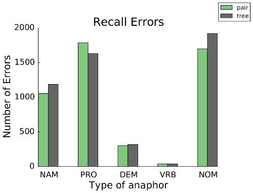

# cort

__cort__ is a <b>co</b>reference <b>r</b>esolution <b>t</b>oolkit. It
implements the coreference resolution error analysis framework described in 
our [EMNLP'14](#references) and [NAACL'15 demo](#references) papers, and also 
ships with well-performing deterministic and learning-based coreference 
resolution systems. 

If you have any questions or comments, drop me an e-mail at 
[sebastian.martschat@gmail.com](mailto:sebastian.martschat@gmail.com).

## Installation

__cort__ is available on PyPi. You can install it via

```
pip install cort
```

Dependencies are [nltk](http://www.nltk.org/), [numpy](http://www.numpy.org/), 
[matplotlib](http://matplotlib.org), 
[mmh3](https://pypi.python.org/pypi/mmh3) and
[future](https://pypi.python.org/pypi/future). __cort__ is written for use on 
Linux with either Python 2.7+ or Python 3.3+.

## Error Analysis

With __cort__, you can analyze recall and precision errors of your coreference 
resolution systems just with a few lines in python. Let us go through an 
example.

### Reading in Data

So far, __cort__ only supports data in [the format from the CoNLL shared tasks 
on coreference resolution](http://conll.cemantix.org/2012/data.html). Let us 
assume that you have some data in this format: all documents with reference 
annotations are in the file `reference.conll`. You have output of two 
coreference resolution systems, the output of the first system is in the file
`pair-output.conll`, while the output of the other system is in the file
 `tree-output.conll`. If you want to compute precision errors, you also need a 
[file that contains antecedent decisions](#antecedents). Let us assume  
we have such a file for the first system, the file is called`pair.antecedents`.

First, let us load the data:

```python
from cort.core import corpora

reference = corpora.Corpus.from_file("reference", open("reference.conll"))
pair = corpora.Corpus.from_file("pair", open("pair-output.conll"))
tree = corpora.Corpus.from_file("tree", open("tree-output.conll"))

# optional -- not needed when you only want to compute recall errors
pair.read_antecedents(open('pair.antecedents'))
```

### Extracting Errors

We now want to extract the errors. For this, we use an `ErrorExtractor`. 
In addition to the corpora, we need to provide the `ErrorExtractor` with the 
algorithms it should use to extract recall and precision errors. We stick to 
the algorithms described in the EMNLP'14 paper.

```python
from cort.analysis import error_extractors
from cort.analysis import spanning_tree_algorithms

extractor = error_extractors.ErrorExtractor(
	reference,
    spanning_tree_algorithms.recall_accessibility,
    spanning_tree_algorithms.precision_system_output
)

extractor.add_system(pair)
extractor.add_system(tree)

errors = extractor.get_errors()
```

That's it! `errors` now contains all errors of the two systems under 
consideration. The errors can be accessed like in a nested dict:
`errors["tree"]["recall_errors"]["all"]` contains all recall errors of the
second system, while `errors["pair"]["precision_errors"]["all"]`contains
all precision errors of the first system. `errors` is an instance of the
class `StructuredCoreferenceAnalysis`.

### Filtering and Categorizing

For further analysis, you will want to filter and categorize the errors you've 
extracted. That's why `StructuredCoreferenceAnalysis` provides the member 
functions `filter` and `categorize`. These take as input functions which 
filter or categorize errors.

Each error is internally represented as a tuple of two `Mention` objects, the 
anaphor and the antecedent. Given an error `e`, we can access these with `e[0]` 
and `e[1]` or with `anaphor, antecedent = e`.

Hence, we can obtain all errors where the anaphor is a pronoun and the
antecedent is a proper name as follows:

```python
pron_anaphor_errors = errors.filter(
	lambda error: error[0].attributes['type'] == "PRO" and 
	              error[1].attributes['type'] == "NAM"
)
```

Or we only do this filtering for recall errors of the second system:

```python
pron_anaphor_tree_recall_errors = errors["tree"]["recall_errors"].filter(
	lambda error: error[0].attributes['type'] == "PRO" and 
	              error[1].attributes['type'] == "NAM"
)
```

We can categorize each error by the mention types of the anaphor:

```python
errors_by_type = errors.categorize(
	lambda error: error[0].attributes['type']
)
```

The corresponding errors can now be accessed with 
`errors_by_type["pair"]["recall_errors"]["all"]["NOM"]`.

For more information on the attributes of the mentions which you can access, 
have a look at the documentation of `Mention`, or consult [the list included 
in this readme](#attributes).


### Visualization

Errors of one system can be visualized by providing the name of the system:

```python
errors_by_type.visualize("pair")
```

This opens a visualization of the errors in a web browser. Below is a
screenshot of the visualization.


The header displays the identifier of the document in focus. The left bar 
contains the navigation panel, which includes
* a list of all documents in the corpus,
* a summary of all errors for the document in focus, and
* lists of reference and system entities for the document in focus.

To the right of the navigation panel, the document in focus is shown. When 
the user picks a reference or system entity from the corresponding list, 
__cort__ displays all recall and precision errors for all mentions which are 
contained in the entity (as labeled red arrows between mentions). 
Alternatively, the user can choose an error category from the error summary. 
In that case, all errors of that category are displayed.

We use color to distinguish between entities: mentions in different entities 
have different background colors. Additionally mentions in reference entities 
have a yellow border, while mentions in system entities have a blue border.


### Plotting

To assess differences in error distributions, __cort__ provides plotting
functionality.

```python
from cort.analysis import plotting

pair_errs = errors_by_type["pair"]["recall_errors"]["all"]
tree_errs = errors_by_type["tree"]["recall_errors"]["all"]

plotting.plot(
    [("pair", [(cat, len(errs)) for cat, errs in pair_errs.items()]),
     ("tree", [(cat, len(errs)) for cat, errs in tree_errs.items()])],
    "Recall Errors",
    "Type of anaphor",
    "Number of Errors")
```

This produces the following plot:



## Coreference Resolution

This toolkit also contains two well-performing coreference 
resolution systems. It contains a deterministic multigraph coreference 
resolution system, which can be invoked via `run-multigraph`, and a 
learning-based mention pair model. which can be trained via `cort-train` and
used for prediction via `cort-predict`.

So far, the systems are restricted to input that follows [the 
format from the CoNLL shared tasks on coreference resolution](http://conll.cemantix.org/2012/data.html).

To run the multigraph system, use

```shell
run-multigraph -in my_data.data -out out.data
```

With the optional argument `-ante`, antecedent decisions are also written to a 
file:

```shell
run-multigraph -in my_data.data -out out.data -ante antecedents_out.data
```

To train the mention pair model, use

```shell
cort-train -in reference.data -out model.obj -extractor cort.coreference.approaches.mention_pairs.extract_training_substructures -perceptron cort.coreference.approaches.mention_pairs.MentionPairsPerceptron -cost_function cort.coreference.cost_functions.null_cost
```

To predict with the mention pair model, use

```shell
cort-predict -in my_data.data -model model.obj -out out.data -ante antecedents_out.data -extractor cort.coreference.approaches.mention_pairs.extract_testing_substructures -perceptron cort.coreference.approaches.mention_pairs.MentionPairsPerceptron -clusterer cort.coreference.clusterer.best_first
```

## <a name="attributes"></a> Mention Attributes

You can access an attribute of a mention `m` via 
`m.attributes['attribute_name']`.

Name | Type | Description
---- | ---- | -----------
tokens | list(str) | the tokens of the mention
head | list(str) | the head words of the mention
pos | list(str) | the part-of-speech tag of the mention
ner | list(str) | the named entity tags of the mention, as found in the data
type | str | the mention type, one of NAM (proper name), NOM (common noun), PRO (pronoun), DEM (demonstrative pronoun), VRB (verb)
fine_type | str | only set when the mention is a nominal or a pronoun, for nominals values DEF (definite noun phrase) or INDEF (bare plural or indefinite), for pronouns values PERS_NOM (personal pronoun, nominative case), PERS_ACC (personal pronoun, accusative), REFL (reflexive pronoun), POSS (possessive pronoun) or POSS_ADJ (possessive adjective, e.g. 'his')
citation_form | str | only set if the mention is a pronoun, then the canonical form of the pronoun, i.e. one of i, you, he, she, it, we, they
grammatical_function | str | either SUBJECT, OBJECT or OTHER
number | str | either SINGULAR, PLURAL or UNKNOWN
gender | str | either MALE, FEMALE, NEUTRAL, PLURAL or UNKNOWN
semantic_class | str | either PERSON, OBJECT or UNKNOWN
sentence_id | int | the sentence id of the mention's sentence (starting at 0)
parse_tree | nltk.ParentedTree | the parse tree of the mention
speaker | str | the speaker of the mention
antecedent | cort.core.mentions.Mention | the antecedent of the mention (intially None)
annotated_set_id | str | the set id of the mention as found in the data
set_id | str | the set id of the mention computed by a coreference resolution approach (initially None)
head_span | cort.core.spans.Span | the span of the head (in the document)
head_index | int | the mention-internal index of the start of the head
is_apposition | bool| whether the mention contains an apposition


## <a name="antecedents"></a>  Format for Antecedent Data

There is no standardized format for storing antecedent decisions on CoNLL 
coreference data. The toolkit expects the following format:

Files should have one antecedent decision per line. Entries in each line are
seperated by tabs. The format is

	doc_id	doc_par	(anaphor_start, anaphor_end)	(ante_start, ante_end)

where

* `doc_id` is the id as in the first column of the CoNLL original data,
* `doc_part` is the part number (with trailing 0s),
* `anaphor_start` is the position in the document where the anaphor begins 
  (counting from 0),
* `anaphor_end` is the position where the anaphor ends (inclusive),
* `ante_start`, `ante_end` analogously for the antecedent.


## <a name="references"></a> References

Sebastian Martschat and Michael Strube (2014). **Recall Error Analysis for 
Coreference Resolution**. In *Proceedings of the 2014 Conference on Empirical 
Methods in Natural Language Processing (EMNLP)*, Doha, Qatar, 25-29 October 
2014, pages 2070-2081. http://aclweb.org/anthology/D/D14/D14-1221.pdf

Sebastian Martschat, Thierry Göckel and Michael Strube (2015). **Analyzing and 
Visualizing Coreference Resolution Errors**. In *Proceedings of the 2015 
Conference of the North American Chapter of the Association for Computational 
Linguistics: Demonstrations*, Denver, Colorado, USA, 31 May-5 June 2015,
pages 6-10. https://aclweb.org/anthology/N/N15/N15-3002.pdf

If you use this toolkit in your research, please cite the EMNLP'14 paper.

## Changelog

__Sunday, 31 May 2015__  
Updated to status of NAACL'15 demo paper.

__Wednesday, 13 May 2015__  
Fixed another bug in the documentation regarding format of antecedent data.

__Tuesday, 3 February 2015__  
Fixed a bug in the documentation: part no. in antecedent file must be with trailing 0s.

__Thursday, 30 October 2014__  
Fixed data structure bug in documents.py. The results from the paper are not affected by this bug.

__Wednesday, 22 October 2014__  
Initial release.
